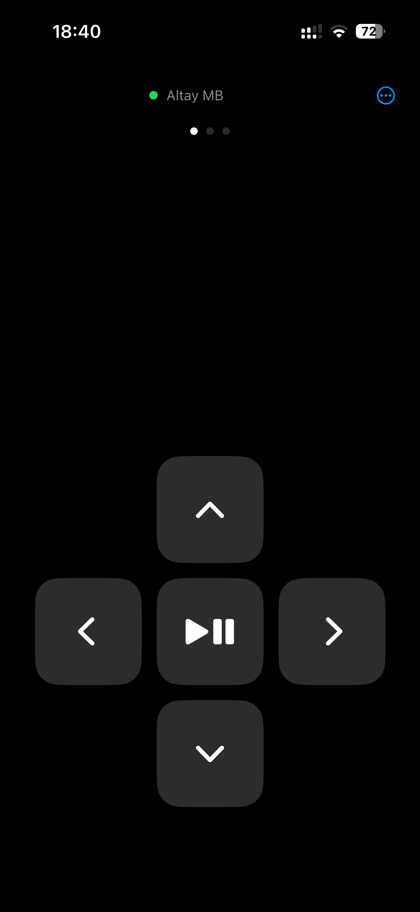
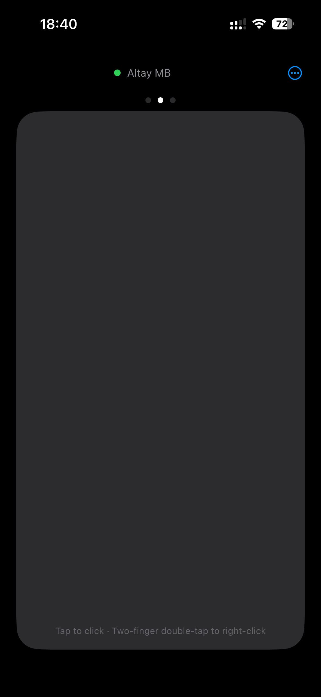
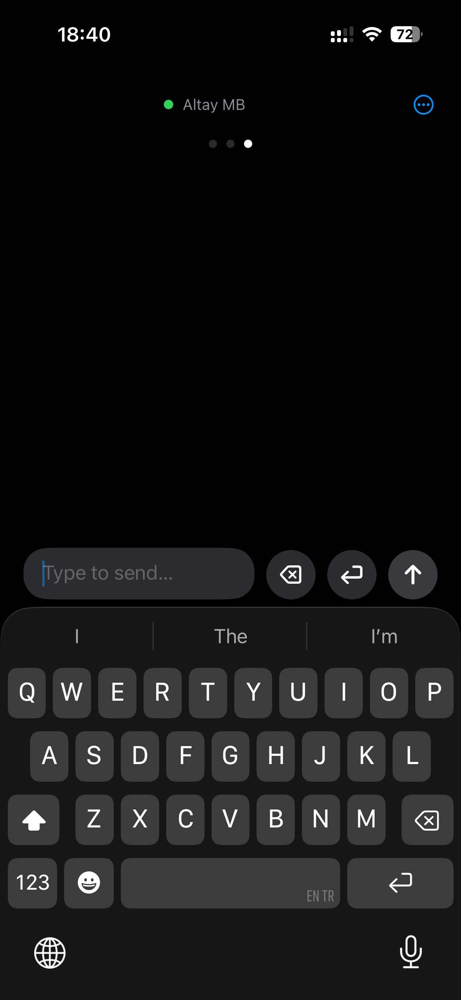

# LazyRemote

Use your iPhone as a remote for your Mac, over Bluetooth.

**[Website](https://ibrahimaltay.github.io/macbook-remote/)** · **[Download for Mac](https://github.com/ibrahimaltay/macbook-remote/releases/latest)** · iPhone app coming soon to the App Store

## Screenshots

  
  
  

## Features

- **Arrow keys & play/pause:** control videos and presentations without leaving your seat.
- **Trackpad:** move the cursor; tap to click, two-finger double-tap to right-click.
- **Keyboard:** type on your iPhone and send the text straight to your Mac.
- **Direct and encrypted:** connects over Bluetooth, with no Wi-Fi setup or accounts.
- **Free:** no ads, no tracking, no in-app purchases.

## Installation

### iPhone

The iPhone app will be on the App Store soon.

### Mac

1. Download `LazyRemote.dmg` from the [latest release](https://github.com/ibrahimaltay/macbook-remote/releases/latest).
2. Open `LazyRemote.dmg`.
3. Drag **LazyRemote** into the **Applications** folder.

## Quickstart

1. On your Mac, open **LazyRemote**.
2. When macOS asks for Bluetooth access, select **Allow**.
3. Make sure that the LazyRemote icon comes into view in the menu bar.
4. Click the LazyRemote icon.
5. Select **Open Accessibility Settings…**.
6. Set **LazyRemote** to on.

   **Note:** LazyRemote must have Accessibility access to send key presses and clicks to your Mac.

7. On your iPhone, open **LazyRemote**.
8. When iOS asks for Bluetooth access, select **Allow**.
9. On your Mac, click the LazyRemote icon in the menu bar.
10. Select **Allow** followed by the name of your iPhone.
11. Make sure that the iPhone shows the name of your Mac with a green dot.
12. Use the trackpad and the buttons below it to control your Mac. To type, tap **Type to send** and then select the send button.

## License

MIT — see [LICENSE](LICENSE).
