# LazyRemote

Use your iPhone as a remote for your Mac, over Bluetooth.

**[Website](https://ibrahimaltay.github.io/lazy-remote-for-desktop/)** · **[Download for Mac](https://github.com/ibrahimaltay/lazy-remote-for-desktop/releases/latest)** · iPhone app coming soon to the App Store

## See It in Action

### Trackpad

Move the cursor with one finger.

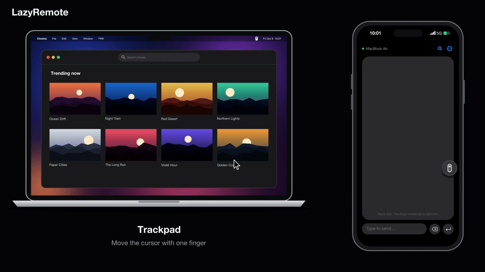

Tap to click. Double-tap and triple-tap work too.

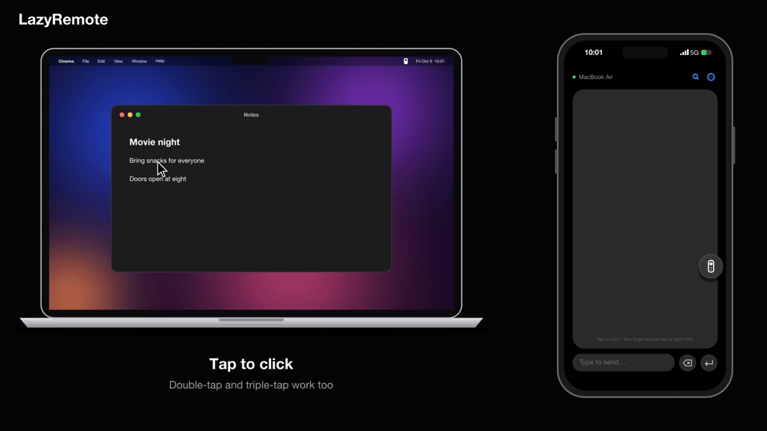

Two-finger double-tap to right-click.

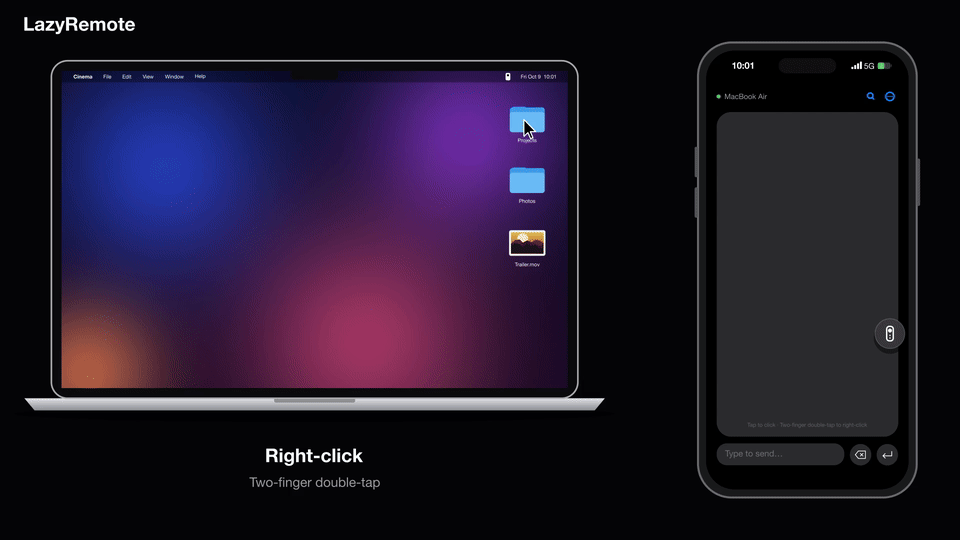

Two-finger scroll, with smooth momentum.

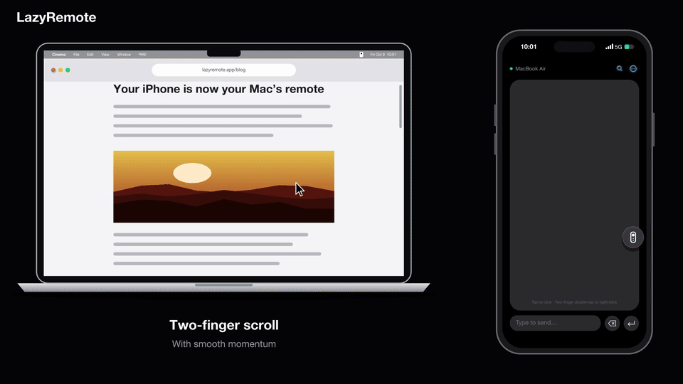

Long-press, then move, to drag.

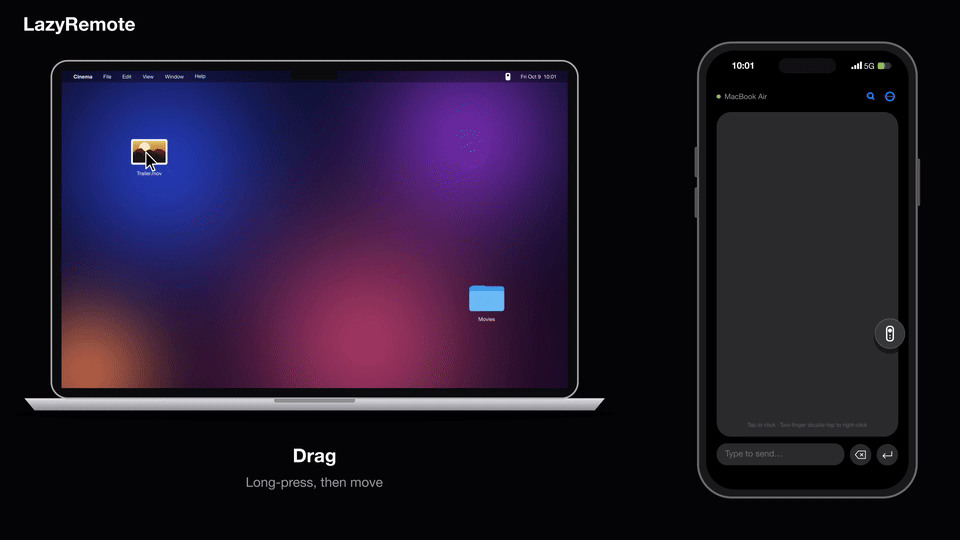

Swipe with three fingers to switch desktops, open Mission Control or show all windows of an app.

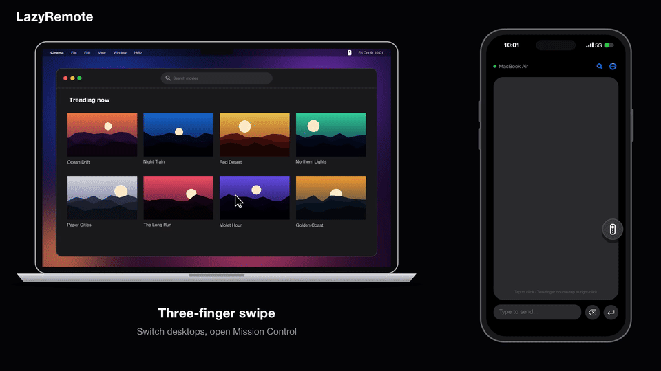

### Floating Remote

A floating remote button you can place anywhere on the screen, or dock in the top bar.

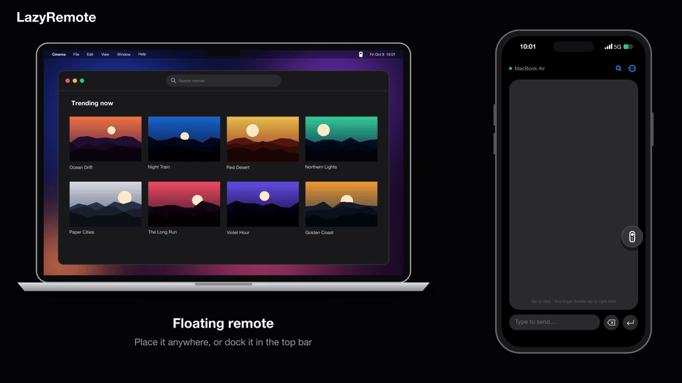

Tap it for a big circular D-pad. Use the arrow keys to move through slides, menus and videos. Hold one to repeat it.

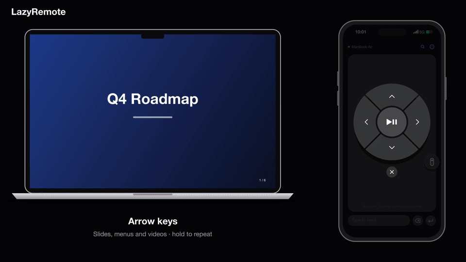

Play/Pause in the center.

### Keyboard

Type on your iPhone and send the text straight to your Mac.

Works in any language, emoji included.

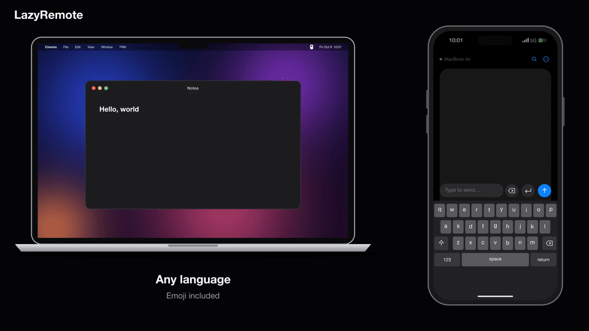

Backspace and Enter buttons. Hold Backspace to delete quickly.

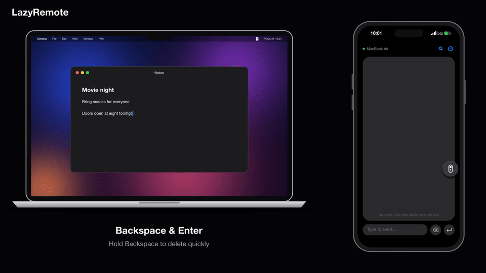

### Spotlight

Tap the magnifier to open Spotlight on your Mac, then type your search from the iPhone.

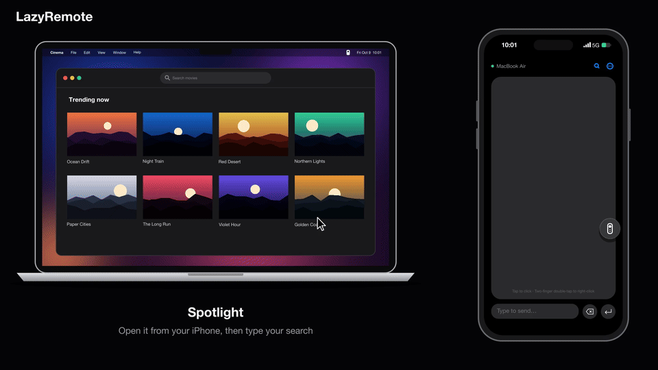

## Features

- **Arrow keys & play/pause:** control videos and presentations without leaving your seat.
- **Trackpad:** move the cursor; tap to click, two-finger double-tap to right-click.
- **Keyboard:** type on your iPhone and send the text straight to your Mac.
- **Spotlight:** opens Spotlight on your Mac by sending ⌘ Space, then type your search from the iPhone. A custom Spotlight shortcut isn't supported.
- **Direct and encrypted:** connects over Bluetooth, with no Wi-Fi setup or accounts.
- **Free:** no ads, no tracking, no in-app purchases.

## Installation

### iPhone

The iPhone app will be on the App Store soon.

### Mac

1. Download `LazyRemote.dmg` from the [latest release](https://github.com/ibrahimaltay/lazy-remote-for-desktop/releases/latest).
2. Open `LazyRemote.dmg`.
3. Drag **LazyRemote** into the **Applications** folder.

## Quickstart

1. On your Mac, open **LazyRemote**.
2. When macOS asks for Bluetooth access, select **Allow**.
3. Make sure that the LazyRemote icon comes into view in the menu bar.
4. Click the LazyRemote icon.
5. Select **Open Accessibility Settings…**.
6. Set **LazyRemote** to on.

   **Note:** LazyRemote must have Accessibility access to send key presses and clicks to your Mac.

7. On your iPhone, open **LazyRemote**.
8. When iOS asks for Bluetooth access, select **Allow**.
9. On your Mac, click the LazyRemote icon in the menu bar.
10. Select **Allow** followed by the name of your iPhone.
11. Make sure that the iPhone shows the name of your Mac with a green dot.
12. Use the trackpad and the buttons below it to control your Mac. To type, tap **Type to send** and then select the send button.

## Reset Pairing

To remove every phone's access and pair again:

1. On the Mac, open the LazyRemote menu and select **Forget All Devices…**.
2. Confirm **Forget All Devices**. Connected phones lose access and all saved phone approvals are removed.
3. On each iPhone, select **Reconnect** from the ellipsis menu.
4. On the Mac, select **Allow** for each phone you want to pair again.

The reset works even when **Enabled** is off. It preserves the Mac's identity,
Enabled setting, Launch at Login preference, and Accessibility permission.
Turn Enabled back on before reconnecting if it was off. The iPhone normally
does not need **Forget Mac**, because the Mac's identity has not changed.
This resets LazyRemote approvals, not system Bluetooth bonds.

If the menu shows **Pairing Reset Failed…**, open it for details and retry
**Forget All Devices…**. Access stays blocked for the current app run until the
reset succeeds. Do not assume restarting clears approvals: a failed deletion
can leave them saved.

## License

MIT — see [LICENSE](LICENSE).
